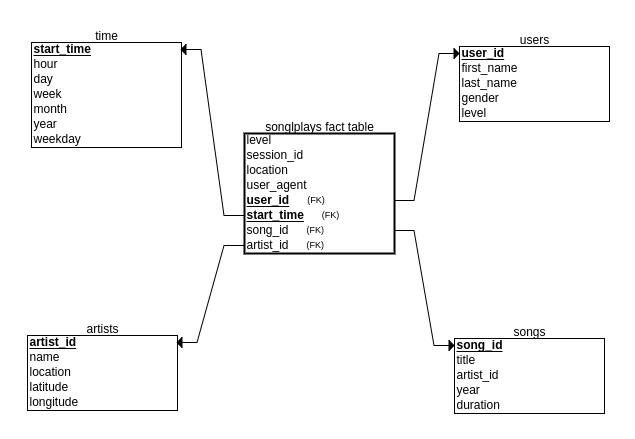

# Data Modeling with PostgreSQL

The goal of this project is to design a database and an ETL pipeline to collect and analyze data about Sparkify users song play habits. User activity of the Sparkify application is logged and collected as JSON files and need to be loaded into a PostgreSQL database for later querying and analysis.

## Database design

The database is designed according to the **star schema** model and includes a fact table, **songplays**, and four dimension tables, **users**, **songs**, **artists** and **time**.
Each table has the following schema:

* **songplays** (start_time varchar, user_id varchar, level varchar, song_id varchar, artist_id varchar, session_id varchar, location varchar, user_agent varchar);
* **users** (user_id varchar, first_name varchar, last_name varchar, gender varchar, level varchar);
* **songs** (song_id varchar, title varchar, artist_id varchar, year int, duration double precision);
* **artists** (artist_id varchar, name varchar, location varchar, latitude double precision, longitude double precision);
* **time** (start_time varchar, hour int, day int, week int, month int, year int, weekday int);



The project includes three Python source files:

* **create_table.py**: connects to the database, drops tables, if already existing, and creates new ones according to the schema described above;
* **sql_queries.sql**: includes queries for dropping tables, create new tables and a specific query used by the ETL process to find a specific song given the title, the artist name and duration;
* **etl.py**: implements the ETL process reading data in JSON format from two set of files, song_data and log_data;

Creating the database and the tables is as easy as running the the **create_tables.py** Python script:

```
python3 create_tables.py
```

## ETL process

The ETL process is implemented in the **etl.py** source file. It reads data from two directories, **data/song_data** and **data/log_data**. The song data directory includes data about songs and artists and is used to fill the corresponding two tables in the database (songs, artists). The log data directory includes data about users and their song play activity and is used to fill the remaining tables in the database (songplays, users, time).

Running the ETL process is as easy as running the **etl.py** Python script:

```
python3 etl.py
```

The **test.ipynb** includes test SQL queries which could be used to check the contents of the database.

## Data files

Data is stored as JSON files in two directories *data/song_data* and *data/log_data*.
Song data is organized as a collection of JSON files containing data about songs and the corresponding artist. Files are partitioned by the first three letters of each song's track ID. For instance the following two files:

```
data/song_data/A/B/C/TRABCPZ128F4275C32.json
data/song_data/A/A/A/TRAAAMO128F1481E7F.json
```

have different track IDs, the first one TR**ABC**PZ128F4275C32 and the second one TR**AAA**MO128F1481E7F. As a result the first one is stored under *data/song_data/A/B/C/* while the second one is stored under *data/song_data/A/A/A/*, in such a way that the directory structure matches the partitioning scheme based on the first three letters of the track ID.
Each file contains data about a song, like the following one:

```
{"num_songs": 1, "artist_id": "ARJIE2Y1187B994AB7", "artist_latitude": null, "artist_longitude": null, "artist_location": "", "artist_name": "Line Renaud", "song_id": "SOUPIRU12A6D4FA1E1", "title": "Der Kleine Dompfaff", "duration": 152.92036, "year": 0}
```

Log data is generated by the Sparkify application and logs the user activity in JSON files. Files are partitioned by year and month. For instance the following file:

```
data/log_data/2018/11/2018-11-12-events.json
```

includes log data collected in November 2018 and, as a result, is stored under *data/loda_data/2018/11/* in such a way that the directory structure matches the partitioning scheme based on year and month.
Each file contains data about the activity of multiple users in the Sparkify app in the specific year and month. A sample data item from the file above includes the following data:

```
{"artist":null,"auth":"Logged In","firstName":"Celeste","gender":"F","itemInSession":0,"lastName":"Williams","length":null,"level":"free","location":"Klamath Falls, OR","method":"GET","page":"Home","registration":1541077528796.0,"sessionId":438,"song":null,"status":200,"ts":1541990217796,"userAgent":"\"Mozilla\/5.0 (Windows NT 6.1; WOW64) AppleWebKit\/537.36 (KHTML, like Gecko) Chrome\/37.0.2062.103 Safari\/537.36\"","userId":"53"}
```
